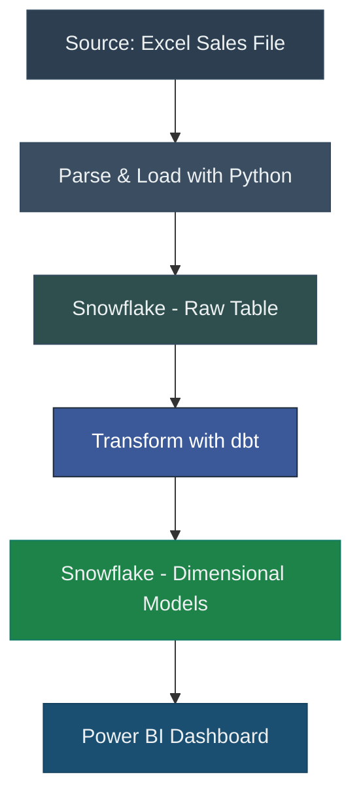
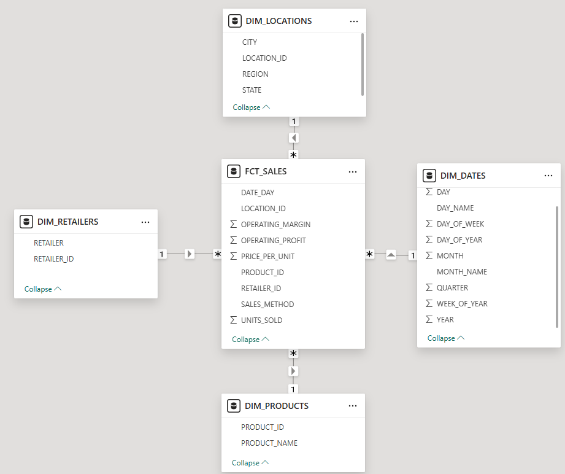
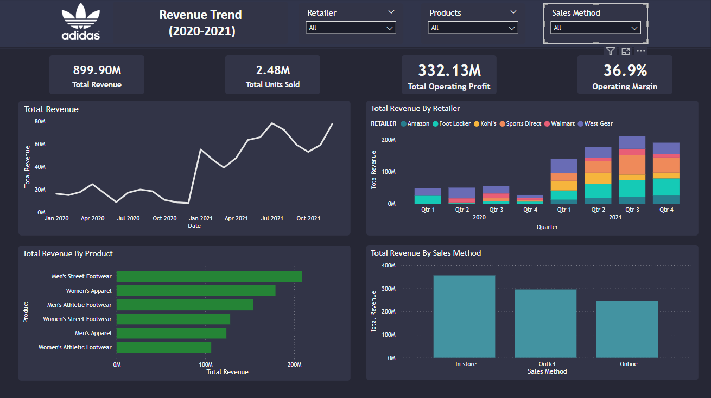

# Adidas Sales Analytics Dashboard

## Overview
This project showcases a complete data pipeline and dashboard solution for analyzing Adidas US sales data. It covers data extraction using Python, transformation and modeling in dbt, and visualization in Power BI. The final output is a dynamic, filterable dashboard highlighting key sales insights by product, retailer, and sales method.

## Key Features
- Extracted and parsed sales data using Python and Pandas  
- Loaded raw sales data into Snowflake using SQLAlchemy  
- Modeled a star schema using dbt (dimensions and fact tables)  
- Built a Power BI dashboard with interactive KPIs and visualizations  
- Enabled drill-through and cross-filtering for user exploration  

## Dataset
The dataset was sourced from Kaggle and includes Adidas US sales figures such as:  
- Retailer  
- Product type  
- Sales method (Online, Outlet, In-Store)  
- Units sold, Revenue, and Operating Profit  
- Geographic location and date of sale  

## Architecture

**Pipeline Flow:**  

## Pipeline Workflow

### 1. Python Ingestion
- Parsed Excel with `pandas.read_excel`  
- Dropped unnecessary columns and printed schema  
- Loaded data into Snowflake using `SQLAlchemy`  

### 2. dbt Modeling
- Created staging models to clean and standardize raw data  
- Built dimension tables: `dim_dates`, `dim_locations`, `dim_products`, `dim_retailers`  
- Built fact table: `fct_sales`  
- All transformations defined in modular SQL with `dbt run` and materializations  

### 3. Power BI
- Connected to Snowflake models via DirectQuery  
- Created interactive visuals: KPIs, trend line, bar charts, and pie chart  
- Implemented slicers for Retailer, Product, and Sales Method  

## Dimensional Model
**Star schema design built in dbt:**  
 

## Power BI Dashboard
The final dashboard includes:  
- KPI cards for Total Revenue, Units Sold, Operating Profit, and Profit Margin  
- Time-based Revenue trend  
- Revenue breakdowns by Retailer, Product, and Sales Method  
- Interactive slicers for all key dimensions  

**Dashboard Screenshot:**  

## Installation & Usage
1. Set up a Snowflake account and create a database/schema  
2. Create a `.env` file with your Snowflake credentials  
3. Run `main.py` to load raw data into a staging table  
4. Initialize and run the dbt project to build models in Snowflake  
5. Open the Power BI file and connect it to your Snowflake schema  

## Tools Used
- Python (`pandas`, `SQLAlchemy`)  
- dbt (modular SQL modeling and transformations)  
- Snowflake (cloud data warehouse)  
- Power BI (dashboarding and visualization)

